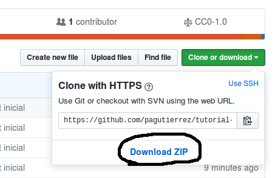

# Tutorial sobre scikit-learn


Este repositorio contiene una serie de material sobre un breve tutorial sobre ``scikit-learn`` en Python. Está basado en el tutorial de ``scikit-learn`` realizado en la conferencia Scipy2017 (ver referencias).


## Conseguir el material para el tutorial

Si tienes una cuenta de Github, la forma más conveniente de bajar el material es realizar un clone del repositorio GitHub o hacer un fork. Puedes clonar el repositorio con el comando:
```bash
git clone https://github.com/pagutierrez/tutorial-sklearn.git

```

Si no estás familiarizado con GitHub o no tienes cuenta, también puedes bajar todo el repositorio como un archivo `.zip`, accediendo a ``Clone or download`` en la cabecera del repositorio (https://github.com/pagutierrez/tutorial-sklearn) y pulsando sobre ``Download ZIP``.



Por favor, ten en cuenta que los contenidos del repositorio pueden cambiar a última hora, así que recomendamos que intentes actualizar los contenidos antes de cada sesión. Si tienes una cuenta de GitHub y has clonado el repositorio, solo tienes que usar el comando:
```bash
git pull origin master
```
En otro caso, tendrás que descargar de nuevo el `.zip` cada vez que quieras actualizar los ficheros.


## Notas de instalación

Este tutorial requiere tener instalaciones lo más recientes posibles de:

- [NumPy](http://www.numpy.org)
- [SciPy](http://www.scipy.org)
- [matplotlib](http://matplotlib.org)
- [pandas](http://pandas.pydata.org)
- [pillow](https://python-pillow.org)
- [scikit-learn](http://scikit-learn.org/stable/)
- [IPython](http://ipython.readthedocs.org/en/stable/)
- [Jupyter Notebook](http://jupyter.org)


Este último es importante. Si lo tienes correctamente instalado, deberías poder teclear:
```bash
    jupyter notebook
```
en tu terminal de comandos y ver el panel de carga de libros de notas en tu navegador web. Intenta abrir y ejecutar cualquiera de los libros que contiene este curso, para ver si funciona todo correctamente.

Para aquellos usuarios que no tengan las dependencias instaladas, una forma relativamente sencilla de conseguirlas es utilizar una distribución de Python como [Anaconda CE](http://store.continuum.io/ "Anaconda CE"), que incluye los paquetes de Python más relevantes para ciencia, matemáticas, ingeniería y análisis de datos. Anaconda puede descargarse e instalarse de forma libre, incluyendo el uso comercial y la redistribución. Los códigos incluidos en este tutorial deberían ser compatibles con Python 2.7 y Python 3.4-3.6. Suponiendo que tengas Anaconda instalado, los siguientes comandos crean un entorno nuevo llamado `sklearn-env` e instalan todas las dependencias:
```bash
conda update conda
conda update anaconda
conda create --prefix ~/sklearn-env scikit-learn
source activate sklearn-env
conda install matplotlib
conda install ipython
conda install pandas
conda install Pillow
```

Tras obtener el material, **recomendamos encarecidamente** abrir y ejecutar el libro de notas ``check_env.ipynb``, que se encuentra en la raíz del repositorio. Para ello, ejecuta el comando:
```bash
jupyter notebook check_env.ipynb
```
Una vez dentro del libro, ejecuta la única celda de código pulsando sobre el botón "Run Cells", tal y como muestra esta figura:


Si tu entorno satisface todos los requisitos para el tutorial, el código ejecutado debería mostrar una salida como la siguiente:
```bash
Using python in /home/pagutierrez/anaconda3
3.6.1 |Anaconda 4.4.0 (64-bit)| (default, May 11 2017, 13:09:58) 
[GCC 4.4.7 20120313 (Red Hat 4.4.7-1)]

[ OK ] numpy version 1.12.1
[ OK ] scipy version 0.19.0
[ OK ] matplotlib version 2.0.2
[ OK ] IPython version 5.3.0
[ OK ] sklearn version 0.18.1
[ OK ] pandas version 0.20.1
[ OK ] PIL version 1.1.7
[ OK ] ipywidgets version 6.0.0
```
Aunque no sea un requisito, te recomendamos actualizar los paquetes Python a su ultima versión, para así asegurar la mejor compatibilidad con el material didáctico. Puedes actualizar los paquetes con los comandos:
```bash
pip install [package-name] --upgrade
```


## Descarga de las bases de datos

Los datos para este tutorial no están incluidos en el repositorio. Vamos a utilizar varios datasets: muchos vienen en scikit-learn, el cuál descarga y guarda los datos.

Debido a que la red puede fallar, sería una buena idea descargar algunos de los datasets (los más pesados) antes de las clases. Por favor, ejecuta:
```bash
python fetch_data.py
```
para descargar estos datasets.

El tamaño de la descarga de los ficheros es, aproximadamente, 280MB y, una vez extraídos en disco ocuparán unos 480MB de tu disco duro.


## Temas


- 01\. Introducción a aprendizaje automático en Python [[notebook](notebooks-spanish/01-introduccion_aprendizaje_automatico.ipynb)][[html](https://rawgit.com/pagutierrez/tutorial-sklearn/master/notebooks-spanish/01-introduccion_aprendizaje_automatico.html)]
- 02\. Herramientas científicas en Python [[notebook](notebooks-spanish/02-herramientas_cientificas_python.ipynb)][[html](https://rawgit.com/pagutierrez/tutorial-sklearn/master/notebooks-spanish/02-herramientas_cientificas_python.html)]
- 03\. Representación y visualización de datos [[notebook](notebooks-spanish/03-representacion_datos_aa.ipynb)][[html](https://rawgit.com/pagutierrez/tutorial-sklearn/master/notebooks-spanish/03-representacion_datos_aa.html)]
- 04\. Aprendizaje supervisado: entrenamiento y test [[notebook](notebooks-spanish/04-entrenando_y_generalizando.ipynb)][[html](https://rawgit.com/pagutierrez/tutorial-sklearn/master/notebooks-spanish/04-entrenando_y_generalizando.html)]
- 05\. Aprendizaje supervisado: clasificación [[notebook](notebooks-spanish/05-aprendizaje_supervisado_clasificacion.ipynb)][[html](https://rawgit.com/pagutierrez/tutorial-sklearn/master/notebooks-spanish/05-aprendizaje_supervisado_clasificacion.html)]
- 06\. Aprendizaje supervisado: regresión [[notebook](notebooks-spanish/06-aprendizaje_supervisado_regresion.ipynb)][[html](https://rawgit.com/pagutierrez/tutorial-sklearn/master/notebooks-spanish/06-aprendizaje_supervisado_regresion.html)]
- 07\. Aprendizaje no supervisado: transformación [[notebook](notebooks-spanish/07-aprendizaje_no_supervisado_transformaciones.ipynb)][[html](https://rawgit.com/pagutierrez/tutorial-sklearn/master/notebooks-spanish/07-aprendizaje_no_supervisado_transformaciones.html)]
- 08\. Aprendizaje no supervisado: agrupamiento [[notebook](notebooks-spanish/08-aprendizaje_no_supervisado_agrupamiento.ipynb)][[html](https://rawgit.com/pagutierrez/tutorial-sklearn/master/notebooks-spanish/08-aprendizaje_no_supervisado_agrupamiento.html)]
- 09\. Un resumen de la interfaz Estimator de scikit-learn [[notebook](notebooks-spanish/09-revision_API_scikitlearn.ipynb)][[html](https://rawgit.com/pagutierrez/tutorial-sklearn/master/notebooks-spanish/09-revision_API_scikitlearn.html)]
- 10\. Caso de estudio - Supervivencia en el Titanic [[notebook](notebooks-spanish/10-caso_estudio_titanic.ipynb)][[html](https://rawgit.com/pagutierrez/tutorial-sklearn/master/notebooks-spanish/10-caso_estudio_titanic.html)]
- 11\. Extracción de características de un texto mediante *Bag-of-Words* (bolsas de palabras) [[notebook](notebooks-spanish/11-extraccion_caracteristicas_texto.ipynb)][[html](https://rawgit.com/pagutierrez/tutorial-sklearn/master/notebooks-spanish/11-extraccion_caracteristicas_texto.html)]
- 12\. Caso de estudio - Clasificación de texto para detección de spam en SMS [[notebook](notebooks-spanish/12-caso_estudio_deteccion_spam_SMS.ipynb)][[html](https://rawgit.com/pagutierrez/tutorial-sklearn/master/notebooks-spanish/12-caso_estudio_deteccion_spam_SMS.html)]
- 13\. Validación cruzada y métodos de evaluación de rendimiento [[notebook](notebooks-spanish/13-validacion_cruzada.ipynb)][[html](https://rawgit.com/pagutierrez/tutorial-sklearn/master/notebooks-spanish/13-validacion_cruzada.html)]
- 14\. Selección de parámetros, validación y test [[notebook](notebooks-spanish/14-complejidad_modelos_busqueda_grid.ipynb)][[html](https://rawgit.com/pagutierrez/tutorial-sklearn/master/notebooks-spanish/14-complejidad_modelos_busqueda_grid.html)]
- 15\. Encadenamiento con tuberías [[notebook](notebooks-spanish/15-encadenando_con_tuberias.ipynb)][[html](https://rawgit.com/pagutierrez/tutorial-sklearn/master/notebooks-spanish/15-encadenando_con_tuberias.html)]
- 16\. Aprendizaje supervisado: evaluación de modelos, métricas de puntuación y manejo de conjuntos de datos no balanceados [[notebook](notebooks-spanish/16-metricas_rendimiento_evaluacion_modelos.ipynb)][[html](https://rawgit.com/pagutierrez/tutorial-sklearn/master/notebooks-spanish/16-metricas_rendimiento_evaluacion_modelos.html)]
- 17\. Aprendizaje supervisado: modelos lineales [[notebook](notebooks-spanish/17-modelos_lineales.ipynb)][[html](https://rawgit.com/pagutierrez/tutorial-sklearn/master/notebooks-spanish/17-modelos_lineales.html)]
- 18\. Aprendizaje supervisado: árboles de decisión y bosques aleatorios [[notebook](notebooks-spanish/18-arboles_y_bosques.ipynb)][[html](https://rawgit.com/pagutierrez/tutorial-sklearn/master/notebooks-spanish/18-arboles_y_bosques.html)]
- 19\. Selección de características [[notebook](notebooks-spanish/19-seleccion_caracteristicas.ipynb)][[html](https://rawgit.com/pagutierrez/tutorial-sklearn/master/notebooks-spanish/19-seleccion_caracteristicas.html)]
- 20\. Aprendizaje no supervisado: agrupamiento jerárquico y métodos basados en densidades [[notebook](notebooks-spanish/20-clustering_jerarquico_y_basado_densidades.ipynb)][[html](notebooks-spanish/20-clustering_jerarquico_y_basado_densidades.html)]
- 21\. Aprendizaje no supervisado: reducción de la dimensionalidad no lineal [[notebook](notebooks-spanish/21-reduccion_dimensionalidad_no_lineal.ipynb)][[html](https://rawgit.com/pagutierrez/tutorial-sklearn/master/notebooks-spanish/21-reduccion_dimensionalidad_no_lineal.html)]
- 22\. Aprendizaje no supervisado: detección de anomalías [[notebook](notebooks-spanish/22-deteccion_anomalias.ipynb)][[html](https://rawgit.com/pagutierrez/tutorial-sklearn/master/notebooks-spanish/22-deteccion_anomalias.html)]
- 23\. *Out-of-core learning* [[notebook](notebooks-spanish/23-aprendizaje_out_of_core.ipynb)][[html](https://rawgit.com/pagutierrez/tutorial-sklearn/master/notebooks-spanish/23-aprendizaje_out_of_core.html)]

# Referencias
Este tutorial es una traducción del tutorial de Alex Gramfort y Andreas Mueller [[Github]](https://github.com/amueller/scipy-2017-sklearn)[[Youtube1]](https://www.youtube.com/watch?v=2kT6QOVSgSg)[[Youtube2]](https://www.youtube.com/watch?v=WLYzSas511I)

Se recomiendan los siguientes tutoriales adicionales para aprender más sobre el manejo de la librería:
- *An introduction to machine learning with scikit-learn*. Documentación oficial de `scikit-learn`. [http://scikit-learn.org/stable/tutorial/basic/tutorial.html](http://scikit-learn.org/stable/tutorial/basic/tutorial.html).
- *A tutorial on statistical-learning for scientific data processing*. Documentación oficial de `scikit-learn`. [http://scikit-learn.org/stable/tutorial/statistical_inference/index.html](http://scikit-learn.org/stable/tutorial/statistical_inference/index.html).

Por último, para aprender la sintaxis básica de Python en menos de 13 horas, se recomienda el siguiente curso de *CodeAcademy*:
- Curso de Python de CodeAcademy. [https://www.codecademy.com/es/learn/python](https://www.codecademy.com/es/learn/python)
